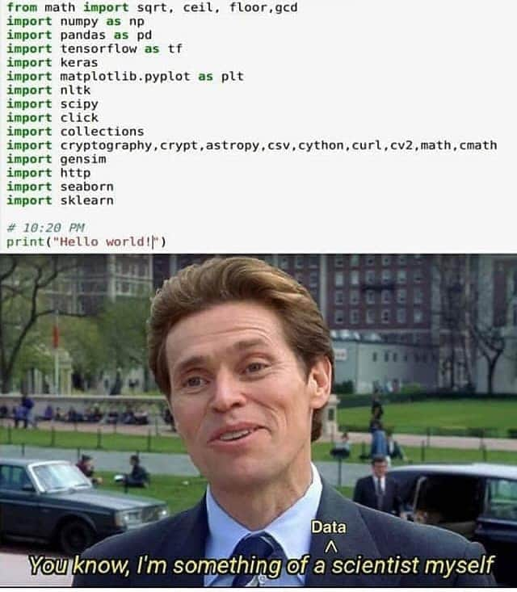
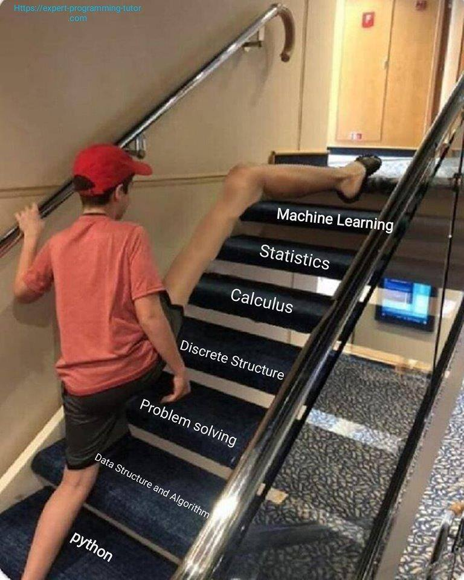

# Introduction

[Data science](https://en.wikipedia.org/wiki/Data_science) has become such a broad field that it is hard to provide a formal definition. The generic idea of associating patterns with tangible phenomena has been practiced for several millennia. For example, humans used the distinction between day and night, measured by the amount of sunlight, to adjust behaviors such as mobility, sleep, etc. - not because of fictional characters such as ghosts and demons, but because of predators and other tangible threats that put the life of one or more individuals or a population at risk. So, if you ever felt threated by the absence of sunlight and tried to stay away from it here's my response to you: "Congratulations! You just applied data science to reduce your total risk".

After reading my response one may ask the question - "Why is the risk higher at night?". To answer this question we to understand two terms: 1) risk, 2) causality. Risk, hazard and harm are different: if we treat harm as the measured outcome we can differentiate hazard and risk as follows: a hazard is a something that has the potential to cause harm (with non-zero probability), whereas risk is the quantification of the probability (some use quantity also, but I will avoid using it to be more principled) of harm.

Going out at night does not guarantee a harmful outcome, but there are few conditions where the risk is higher than usual. For example, leopards are nocturnal (active during the night) predators and are thought to be a threat to humans in places like Mumbai, India - read [this](https://www.theguardian.com/cities/2018/mar/23/mumbai-leopards-stray-dogs-protect-sanjay-gandhi-national-park) interesting article. We can easily infer that lack of sunlight is not the reason for the increase in probability of harm - lack of sunlight affects our vision, which exposes us to the true historical / potential **causes** (superset of hazards in this case) of harm.

Ghosts and demons are unreliable risk factors because: a) detection of a leopard is objective and does not vary across observers whereas detection of ghosts is highly variable within and between observers due to biases, b) even if ghosts are real and if a set of rules are estabilished for the detection of ghosts (independent of observers), evidence should be provided to prove the increase in risk due to ghosts either through controlled or observational studies. Thinking that ghosts are a threat to humans without checking these two criteria is an emotional decision.

Emotions play a significant role in every day decisions - for example, people believe that travel by air is riskier than travel by road - read [this](https://traveltips.usatoday.com/air-travel-safer-car-travel-1581.html) article for a summary. In the remainder of this book we make a clear distinction - luck, ghosts, and emotions are not scientific and will not be a part of causal explanations given to observed phenomena. The 'effect' of these factors will be quantified if possible - this activity is called uncertainty quantification.

<Write about the types of uncertainties: uncertainty in outcome, uncertainty in predictors for the given example>

## The data scientist in scientists

The first *formal* use of data science methods was done by [Sir Francis Galton](https://en.wikipedia.org/wiki/Francis_Galton) - reading only the third paragraph will give goosebumps. He observed that extreme characteristics of parents such as height were not passed on completely to the offspring - a concept called [regression to the mean](https://en.wikipedia.org/wiki/Regression_toward_the_mean). In simpler terms, if we assume the parents are the first generation and the offsprings are the second generation, an offspring is expected to be fewer deviations away (with respect to the second generation) from the mean compared to the parent (with respect to the first generation). In chapter <1> we will reproduce his analysis by analyzing the same data set.

Galton, despite his brilliance, believed in eugenics because the data provided evidence in its favor. However, in modern days eugenics is considered as an [unethical practice](https://www.ncbi.nlm.nih.gov/pmc/articles/PMC1129063/). But the stage was set for data science - methods for doing data science such as correlation and regression analysis became popular. Statistical measures such as **mean** became common in lab experiments - for example, in lab experiments to:

1. *Estimate* the value of acceleration due to gravity using a pendulum and a digital clock
2. *Estimate* the focal length of a convex lens by focusing a long-distant object on a screen
3. *Estimate* the tension of a string using a wedge and a tuning fork

In each case the experiment was repeated several times and the average value was calculated to estimate a physical quantity. Despite all the calculations I had no idea that averaging was done to reduce (standard) error. When I saw the similarities across experiments I understood the link - measurements vary across experiments because of a) uncontrollable factors, 2) measuring instrument, 3) observer or individual who is recording the measurement. It finally became clear to me that statistics is essential to do science. When I started looking at scientists with this filter it became clear to me that all scientists are trying to fit models to explain the data. Voila!

## Re-examining Newton's law of gravitation

### Short story inspired by [Cosmos: A Spacetime Odyssey](https://en.wikipedia.org/wiki/Cosmos:_A_Spacetime_Odyssey)

[Sir Isaac Newton](https://en.wikipedia.org/wiki/Isaac_Newton) has contributed to several domains - astronomy, mathematics, and theology to name a few. His universal law of gravitation was one of greatest triumphs in astrophysics that allowed scientists to use a simple law that is applicable on Earth to astronomical objects that were far beyond our reach. [Edmund Halley](https://en.wikipedia.org/wiki/Edmond_Halley) used the law to estimate that a comet that appeared in 1682 was identical to two comets that appeared in 1531 and 1607. Using just the law he predicted that the comet will reappear in 1758. Unlike religious predictions of apocalyptic end of life on Earth, the stakes were extremely high for this prediction. As predicted by Halley the comet appeared in 1758, which he did not live to see.

### Newton's law of gravitation as data analysis

Newton did his part in the formulation of the law of gravitation. It was the most prolific scientific achievement of the century that could not be accomplished by other greats like [Robert Hooke](https://en.wikipedia.org/wiki/Robert_Hooke), the inventor of [Hooke's law](https://en.wikipedia.org/wiki/Hooke%27s_law) who is also known for coining the term 'cell'. Creation of the law was facilitated by the contributions of [Tycho Brahe](https://en.wikipedia.org/wiki/Tycho_Brahe) towards data collection and [Johannes Kepler](https://en.wikipedia.org/wiki/Johannes_Kepler) towards planetary motion and heliocentrism.

My personal curiosity was sparked by one question: how do all the observations bind together to tell a coherent story, so I read the [Principia Mathematica](https://en.wikipedia.org/wiki/Principia_Mathematica). Finally it made complete sense - the book used observations from Earth to systematically argue why Mercury and Venus were inferior planets and the other three (Uranus (1781) and Neptune (1846) were discovered later) were superior planets, why Kepler used elliptical orbits for planets (visualizations for inferring elliptical orbits) and extensions of Kepler's laws (estimation of area swept in equal intervals of time) to form an elegant equation.

Today we are aware that Newton's universal law of gravitation is not accurate enough to explain the motion of Mercury. It took another scientific genius ([Albert Einstein](https://en.wikipedia.org/wiki/Albert_Einstein)) to fit the curve in a better way and simultaneously come up with a law that generalizes well to astronomical objects that were not observed during his lifetime. This is (data) science at work!

## Theory vs practice

### Examples of experimentation driving science

With all due respect to experimentalists I'm presenting my limited understanding of the role of experimentation in science before presenting my understanding of the role of theory. It's not hard to guess that I strongly favor the *need* for theory and first principles to drive science. However, historically this has not been the case and experimentalists have made giant leaps in the direction of scientific progress. There are several examples of such advancements; let's focus on the work of Ernest Rutherford.

["If your experiment needs statistics, you ought to have done a better experiment"](https://www.quora.com/What-did-Ernest-Rutherford-mean-by-If-your-experiment-needs-statistics-you-ought-to-have-done-a-better-experiment) - Ernest Rutherford

### Examples of theory driving science

Section to be filled

### Some thoughts on theory vs practice

Rutherford's picture is not complete. It's often not easy to experiment with a system by varying one measurement while controlling all other measurements. For example, in order to study the effect of 1918 influenza pandemic on human immunity it's not possible to travel back in time to change the progression of the disease to observe the effect on today's average immunity to flu antigens. It may be appropriate to say "Ok, instead I will clone an identical antigen and allow it to spread in 2020", but the average human immunity to influenza has changed between 1918 and 2020. Non-stationarity of the outcome makes experimentation extremely hard. In case of non-stationarity the best solution is to perform simultaneous test-control studies. [This](https://physicstoday.scitation.org/do/10.1063/PT.5.010218/full/) article provides insights on the need for *correct* models to test hypotheses. However, it does not dismiss the **need** for experimentation. Currently experimentation is the best way to establish **causality**. Statistical methods for establishing causality are evolving over the years, but are relatively immature.

#### A personal story

The article ["Using statistics to catch cheats and criminals"](https://physicstoday.scitation.org/do/10.1063/PT.5.010218/full/) reminds me of a cause that I stood for in 2014-15 that was blatant. The effects of the 'varoables' were *significant* beyond doubt. "Powerful people" were doing what they always do - abusing their power. Though the "agitation" was limited to a Facebook post and did not lead to significant change in behavior of "powerful people", it turned out to be a (emotionally) memorable event.

The affected people (majority, ~300 out of ~350) implicitly acknowledged the injustice, but never managed to voice their concerns in a structured way. During that phase of life I had nothing to lose, so I decided to write about the injustice on Facebook. Despite the best efforts of the "powerful people" I did not delete the post. The response from the exploited people was a pleasant surprise. In support of the agitation several people liked the post and unliked it within seconds in order to remove any publicly quotable evidence.

#### Learnings from the story

It is essential to be as less subjective (emotional) as possible to draw conclusions that conform to the principles of science. In the end there was no tangible outcome. The event was merely a standoff between two groups, but this led to few important insights:

1. Even though I did not have anything to lose, the post was made in a generic way. Firstly, if a particular group claimed to be offended by the post and wanted to take legal action against me, they first had to acknowledge their misdeeds publicly
2. Opinions can be wrong, but carefully tested hypotheses are scientific. Any form of dissent requires strong evidence and should be expressed in a way that either exploits uncertainties in law or does what's deemed lawful. Also, [ignorantia juris non excusat](https://en.wikipedia.org/wiki/Ignorantia_juris_non_excusat)
3. Being a 'yes man' is the norm despite the 'wannabe' nature of majority of the individuals. Society does not support whistleblowers and dissenters. This should not be shocking because upholding age-old practices is not always wrong; people who go against those practices are not always right

**Notes:**

1. The approach is summarized in [this](http://image.slidesharecdn.com/radicalinnovationfinal-140328064741-phpapp02/95/radical-rules-for-radical-innovation-29-638.jpg?cb=1406816127&fbclid=IwAR2wg4ZOJYvlaeB1qWcB7ykjLxSjzjI99Jy8IEOsFITchBroQPee2ONo7EQ) image. This is not my original content. I hope the right people were acknowledged.
2. I've had several unpleasant experiences with people who tried to abuse their power for their personal or professional benefits. The learnings from this event shaped my response to such situations

## Tru(uuuuu...)th about modern data scientists

I consider this section a 'fall from grace' because we are transitioning instantaneously from incredible science (repeatability, reproducibility, predictive power, etc.) to a highly subjective topic: emotions.

The intent of this section is to bring the lack of competency in the data science industry to light in a gentlemanly (read: this is the best I can do) way. Let's get started!

Note: Few stories (not all) are exaggerated to (hopefully) enhance the impact. I will not name them, so have fun!

### The unreasonable effectiveness of ... lies, emotions and 'people connect'

I was one of two *developers* involved in mathematical modeling of product substitution. The timeline - 1 week - was highly unrealistic (if this sounds new, welcome to the world of consulting!). After reading few research papers I quickly understood that the mathematical models are very complicated, and involve creation of *consumer decision tree*, *nested modeling*, etc. After some brainstorming with the business team (i.e. the people who promised a working demo in 1 week without understanding the difficulties such as time complexity of storage/querying, quantitative analysis, coding, scaling, etc.), we came to a conclusion that we need to frame a metric that looks similar to *variance*. So we took a page out of economics of competition (specifically [HHI](https://en.wikipedia.org/wiki/Herfindahl%E2%80%93Hirschman_Index)) and designed a simple scoring function that was scalable! The math was so simple that even a high schooler with an average understanding of algebra would easily understand all the nuances of the model.

The fateful day arrived: we had to sell this model to a panel of experts. We prepared 'fancy' charts to abstract out all the (not so) sophisticated queries and code. We were aware that explaining charts remotely through an online meeting is difficult, so we requested a colleague (salesperson) to travel to the client's office on the other side of the planet. This decision proved to be a deal winner!

The meeting started as expected. The panel members were least bothered about the tools used or the sophistication of the algorithm, but were interested in the results. This was expected, but the panel members struggled to understand (uncluttered) scatter plots colored by categories, and could not understand simple mathematics such as *sum-product*. We quickly realized that the panel will lose interest before we share the astonishing results. This is where the salesperson stepped in - the salesperson started giving examples of well known crackers, claimed to have consumed them and suggested (well-known) substitutes. This sparked some interesting (emotional) conversations among the panel members about their favorite crackers and what they would buy if their favorite crackers were out of stock. Amazingly, our simple yet parsimonious mathematical model obtained the expected results - it predicted 4 out of 5 of their proposed (emotional) substitutes correctly (top 1 accuracy, and the top 3 predictions were sufficient to capture the misclassified substitute).

The salesperson's cameo worked positively. The sale went through! But let's analyze this situation objectively:

1. The salesperson never consumed any of those crackers
2. It takes just a simple Google search to identify the substitutes for the top selling crackers. Google may have a better model than we did!
3. The panel of experts were considering their choice of substitutes as the *gold standard*. The truth may be significantly different (for example: if the target demographic is significantly different from that of the panel), but it did not matter to them. Our sale would not have gone through if the data had not supported their choices.

This is a true story; this is (almost) every data scientist's story. Even if the story doesn't make sense, there is one important lesson to take back: we often use the data to support a story we already assume as the truth, or we use data to massage the ego of one or more people. This is outside the scope of science. In my opinion this is not data science!

### The story of normality of ... independent variables in linear regression

If the story wasn't depressing enough, there's more to come! After several disappointing years spent in a system that encourages mediocrity, yes-men, bigotry, credit-stealing, etc. I decided to travel to USA to pursue a higher degree. The journey was arduous - I had to cater to the need and greed of mediocre people while I was completing prerequisite courses, knowing that I may not get even a single admit. But it paid off - I got the admits I wanted. The time I spent in graduate school was invaluable. I created my own path, worked with awesome people - some over 10 years younger than me, studied interesting topics across departments, started working on interesting problems, and completed several courses from my course backlog (which was 100+ when I quit my job).

Finally, it was time to start attending interviews to get back to industry. The process was harder than expected - I did not receive even a single interview call, whereas, by the same time in the previous year I had three intership offers. Finally the interview call came; it was from a reputed company. I was confident because I had a good track record with interview conversions over the previous 4 years. The interview started as expected - the usual "Tell me something about yourself" followed by "Can you explain a data science project in detail". Things went smoothly in the initial phase despite the difficulties in understand each other's accent. Finally the technical questions started coming - "How do you interpret a linear regression model?", "What does p-value mean?", and finally "What are the assumptions on distribution of independent variables for a linear regression model to be valid?". I promptly answered all questions - "There are no assumptions on the distribution of independent variables in linear regression" to the final question.

At this time the interviewer, who was already uncomfortable with few points that tested his understanding of linear regression, responded "Are you sure?". I tried to keep it simple by saying "Yes", but the interviewer repeated the question several times, stated that the books state something else, and tried to force me to state that the independent variables should be normally distributed for linear regression. I quickly realized that the discussion was getting too personal, but I stood by my knowledge which, in this case, was right. The interviewer soon turned each point into an argument and was probing me continuously to find examples of topics that were known to him/her, but not known to me. We sailed through all terms (*just the names which, in my opinion, is a sheer overrepresentation of skill*) used in  variable transformations, feature selection, model evaluation, ... The interviewer finally found one - "Recursive Feature Elimination" (RFE) - and pounced on it.

The interviewer asked me: "If you don't know RFE, how do you perform feature elimination?". My answer was "Variable elimination requires a measure of relative importance of variables, and may vary from model to model. For example, in a linear model we can use p-value, F-...". The interviewer stopped me and asked me to design a scheme for feature elimination for random forest. So I started with cross-validation, full model building, reduced model building with each variable left out, and variable elimination based on model evaluation (cross-validated, averaged) metrics. The interviewer mentioned that the scheme was computationally expensive. I replied "There may be better schemes, but this is the best I can do with very little thought". The interviewer turned his/her attention back to RFE and asked for its computational complexity (to compare with the complexity of the scheme I developed). The answer was obvious "I already mentioned that I don't know RFE, so I cannot compare". I understood that the interviewer assumed that RFE is far more efficient compared the the scheme I built, and I gave him/her the benefit of doubt at the moment because I did not know RFE (*note: I was not aware of the name, but I knew how it works*).

The interview ended (negatively). What annoyed me the most was that it was extended by 20 minutes, and both of us wasted 20 minutes of our lives. I guessed the result (correctly), and decided to move on. The first step in learning from any experience is to look for learning opportunities. So the first step I took was to understand how RFE works. I opened [RFE's Scikit-learn documentation](https://scikit-learn.org/stable/modules/generated/sklearn.feature_selection.RFE.html) and quickly realized that it matched my computational scheme almost perfectly. I computed its computational complexity of RFE for random forest and found that it matched the complexity of the scheme I developed (*note: variable importance in RF (permutation importance variant that is widely used nowadays, and not the [Gini based importance that can be highly misleading](https://blog.hwr-berlin.de/codeandstats/variable-importance-in-random-forests/)) has the same complexity as the scheme discussed above*). Naturally, I burst into laughter, because the mediocrity that haunted me in the past was after me again. But this incident taught me a valuable lesson about myself - I had subconsciously decided to take the risk (and, therefore, to accept all the associated setbacks (such as remaining jobless as an international student)) to swim out of the pool of mediocrity towards a perceived shore. I'm probably not be the first person in this mental situation. It proved to be a motiviation rather than a stress; it raised my hopes instead of lowering it.

Under these circumstances I'm not trying to plead 'not guilty'. Standing one's ground (for example: in favor of facts) is a sign of guilt in the eyes of people with power who can manipulate emotions. There is no point in fighting such a battle because egoistic people (both parties in the above scenario) almost always perceive their result as a victory.

This story does not have a conclusion because of two reasons: a) I'm not a storyteller, b) the future is uncertain. These experiences gave me a vision that, in spite of involvement of mediocre people and lack of income, will keep me on my toes and force me to update myself. Life is too simple to be contained by trivial roadblocks.

The magnitude of risk faced by even the most passionate of data scientists is tiny compared to the risks faced by [Giordano Bruno](https://en.wikipedia.org/wiki/Giordano_Bruno), [Galileo Galilei](https://en.wikipedia.org/wiki/Galileo_Galilei), [Edmund Halley](https://en.wikipedia.org/wiki/Edmond_Halley), [Isaac Newton](https://en.wikipedia.org/wiki/Isaac_Newton), [Georg Cantor](https://en.wikipedia.org/wiki/Georg_Cantor), [Ludwig Boltzmann](https://en.wikipedia.org/wiki/Ludwig_Boltzmann), and several other scientists who were considered blasphemous. It is alright if your ML model failed to recommend the correct online news article to a customer; the modeler can forgive himself/herself even if the business people don't forgive him/her for not achieving 100% accuracy (on any arbitrary problem).

### How many imports should one make to call oneself a data scientist?

Consider this thought experiment - person A built an application on [R Shiny](https://shiny.rstudio.com/) by using widgets. Person B is a full stack developer with skills in R, Python, HTML, CSS, JavaScript, etc. Both 'full stack developers' meet and have a conversation.

A: "Hey B, I built a full-stack application that's very useful for business"

B: "That's great, can I take a look?"

A: "Unfortunately I can't show you the application, but I can tell you, it has every plot under the Sun and allows business users to view KPIs and dynamically drill down to the root cause"

B: "Sounds great! Which tech stack did you use?"

A: "Tech stack? What does that mean?"

B (sipping some water): "Oh, I meant the set of tools used as database, backend, middleware and frontend"

A: "Oh, I used R Shiny..."

B (almost unable to control the laughter):

A: "What so funny?"

B: "Nothing. Great work!"

B unethically peeks into A's computer to take a look at the application. It looked more or less like this:

A noticed B looking into the dashboard. The conversation resumed:

A: "Don't you think it's cool?"

B: "Sure, looks great!"

A: "I know you are a great full-stack deveoper. Do you have suggestions to improve my app?"

B: "Nothing much really. You may want to change the font style and size of the dashboard title"

A: "Ok, let me do it right away"

B curiously looks at A's steps to modify the font style and size. They were as follows:

1. Look at the documentation of ?shinydashboard::dashboardHeader. Problem could not be solved
2. Google "stackoverflow change shinydashboard header font style"
3. Copy paste the CSS code into a new file, save and build the HTML using R Studio

A: "Well, there you go! It was harder than I thought, but I did it!"

B: "Great work! It looks good now. Good luck!"

Moral: R Shiny uses widgets to abstract away the difficulties of building UI using HTML, CSS, JavaScript, etc. There are several simple components in R Shiny that require knowledge of the underlying concepts. Several widgetized components use HTML / JavaScript in the backend. Only simple applications can be built without knowing the underlying constructs.

The moral of this story was kept soft (intentionally), but there's an important message to the reader: importing packages without the curiosity to know (or understand) the underlying constructs is not a passion, it is a hobby. Most data scientists in the world, especially in body-shop companies, are pursuing a hobby and are getting paid for it - how cool is that?!

### "If only god can save our souls, only Cloud can save our neural networks"

It should be no surprise by now that I made up this quote.

This story, despite being slightly old, is relatively fresh in my memory because it has an emotional background. Background (emotional) story: For readers who are not Indian, [IIT-JEE](https://en.wikipedia.org/wiki/Joint_Entrance_Examination_%E2%80%93_Advanced) is considered one of the toughest exams in the world, and All India Rank 1 (AIR-1) is considered an achievement by itself, even if the person who achieves this feat does nothing in his/her life later. There was a legend about one of the AIR-1 candidates (don't remember the name or year) during IIT-JEE preparation days.

The story goes like this: a chemistry teach was teaching passionately while this person was joking playfully. The teacher, who was annoyed after a while, asked the student a tough question (some say it was the toughest question ever):

$$<some\ really\ complicated\ chemical> + <some\ other\ really\ complicated\ chemical> \to_{it's\ complicated} <another\ really\ complicated\ chemical>$$

Question: What is should one do to this reaction to get $<yet another\ really\ complicated\ chemical>$?

The student looked at the teacher, laughed, and said "pour water" in a sarcastic way to say "cool down". But that was the right answer - "pour water". This answer could not be found hidden in the P. W. Atkins (Physical Chemistry), Morrison & Boyd (Organic Chemistry), etc. The student went on to become AIR-1! The legend ends here, the relevance of this legend may become clear later.

Fast forward several years to 2017, the new story begins. I received an award in early 2017 for my contributions in "The unreasonable effectiveness of ... lies, emotions and 'people connect'" (the tangible contribution, not for the 'people connect'). As a result, I assumed that awards are important and that presentations in "Town Hall" and "India Team Meeting" have value.

Here's the typical flow of one of these meetings: 2+ grueling hours of ordinary people presenting ordinary work as extraordinary results (everyone believes them), followed by the C_O delivering 15-30 minutes of pure motivation, finally followed by 30 minutes of forward looking technical work. I learnt to wait for the final 30 minutes which were of importance to me. One presentation was on applications of neural networks in product categorization.

To my surprise this presentation was unusually candid - the team talked about "term frequency–inverse document frequency vectorizer", "stemming vs lemmatization", "GPUs to speed up matrix computation", etc. These are usually taboo in such meetings (even though they are forward looking) because they expose the extremely ordinary thought process of ordinary people. Only terms like "artificial intelligence", "scalable deep learning", etc. were allowed.

As the meeting progressed, the team highlighted their difficulties. Despite having cool ideas (*relatively speaking*) they were unsuccessful in training the neural network because the GPU ran out of memory in the very first iteration. In conclusion, the team moved their data and code to Cloud and achieved 97% accuracy by leveraging the scale. This is where I started having concerns. It should be no surprise that the ~10 MB text file can bloat up after performing TF-IDF, but there were other concerns. I questioned them during the meeting (taboo #2).

Me: "What vectorization (taboo already committed, so I'm not counting this) did you use?"

Them: "Term-document matrix"

Me: "What was your vocabulary size (taboo #3)?"

Them: "Vocabulary size? What does that mean?"

Me: "Number of columns in term-document matrix"

Them: "Oh, that was a lot! 1 million, or maybe more?"

Me (stunned): "Ok, looks odd. Did you discard words that appeared as little as once?"

Them: "No"

Me: "Ok, that's fine (not really, but it was necessary to say this to make progress in such conversations). What was your batch size (taboo #4)?"

Them: "Please explain"

Me: "Ok, how many rows did you take in while executing the training loop (taboo, maybe?)?"

Them: "We took the whole matrix - x million records"

Me: "Ok, that's fine (you know the drill). What was the data type of each cell?"

Them: "How am I supposed to know that?"

Me: "Ok, at least tell me this - how did you build the matrix?"

Them: "We used sklearn.you_can_find_this_online.just_Google_it.CountVectorizer"

Me: "Alright, I assume you have float32 type (**I was wrong, it's int64**), which is 4 bytes (taboo #5) per cell. (After some back of the envelope calculation) You are expected to use y GB of GPU memory, which is well above your machine's GPU memory"

Them: "Yes, precisely! That's why we moved it to Cloud"

Me: "Ok, that's not the point. Did you estimate the accuracy using binary (taboo #<whatever, I don't want to count>) vectors instead of count?"

Them: "No, we can always do that. Do you think it'll make it >97%?"

Me: "No, but it will reduce the GPU memory requirement by a factor of 32 (**I was wrong, it was 64**), which amounts to only y MB. It may (or may not) decrease your accuracy by a bit"

Them: "Then why should we do it?"

Me: "It's worth trying"

Them: "Cool, thank you (*performing slow claps to suggest that the meeting was over; probably signalling me to stop rambling*)! Any other suggestions from the rest of the company?"

Me: "Sorry, I'm not done (taboo #$\infty$). You should probably consider using mini batches (taboo #$\infty + 1$). Also storing it as sparse matrix (taboo #$\infty + 2$) may save more space. You can further compress the counts using delta compression (taboo #$\infty + 3$). A problem of this scale will probably never need to be on Cloud and can be run on a laptop (taboo #$\infty^\infty$)"

I had more suggestions around class balance (it was multiclass), but after this statement I was overcome by emotions - this was my "pour water" moment. This realization was very deep because I never had faith in myself and everyone around me was superior (at least on paper / designation). But was it really a "pour water" moment?

The team implemented few of my suggestions. They used a Cloud VM to run something that required at max 1 GB of GPU memory. Using binary vectorizer they achieved a higher accuracy than count vectorizer. So they reappeared in the next India Team Meeting and presented their results: 98% accuracy. Their work stole the spotlight as one of the most innovative and forward looking projects in the company. It should be obvious by now that I was not credited.

Moral: Leo Beebe (just the movie portrayal) in [Ford vs Ferrari](https://www.imdb.com/title/tt1950186/) movie is real. Sales (a.k.a. customer success) team treats techincal people as either:

- a scape goat when they fail
- a black sheep when they succeed

If you are a technical person who focuses on depth / details, be prepared to be treated like an animal!

## Lessons learnt from these experiences

I hope you had fun reading these stories. Though these accounts were not 100% accurate there are important lessons to be learnt from them that deal primarily with science, morality and interpersonal communication.

### I'm getting started. These experiences are scary as they sound commonplace

Welcome to data science! I sincerely wish you a happy journey. Fortunately the field is more diverse now than ever before. This makes each individual's journey almost unique. I tried to present scenarios that were experienced by myself and other people I know. You may or may not encounter any of these situations. I request you to write about your experiences without hiding the 'nasty' details because people like me may be able to learn from your experiences.

### I listened to your story and share similar experiences. Now what should I do?

At work a honest, sincere and pedantic data scientist  is *likely* to face one or more such scenarios irrespective of the workplace. It is important to note that we are employed in industry to make economical decisions to monetarily benefit a company in short/long term. Despite the pedantic approach it is important to have finite number of tangible deliverables to financially justify our paycheck. I don't have anything to say other than: make yourself responsible, accountable and efficient at work with the target to become one of the best data scientists in the future. This journey is not going to be short; this journey is not going to be without hurdles. But don't ever fail to justify your paycheck, and, if you can, be grateful to the *experiences* (employer may not necessarily play a part in this).

### I'm a member of the sales team. I feel offended!

I partially understand your point-of-view. Most sales team members have never done hands-on work. Try to understand the voice of your delivery team. Your tag line - "customer success" - is not only about getting 10x work done by your team in 1/10th of the time at the cost of their personal lives. Be clear and honest about the work you sign up for. Most team members need clarity from you so that they can play out a 'victory scenario' on paper (this phase is called 'planning') and attempt to execute it. Planning requires a set of time-bound goals that are mostly unchanging (with a certain predefined margin of error) over a given period of time (at least a sprint). Few 'bad apples' (like me) in your team will never be satisfied with the quality of work - your clarity will give them a clearer idea about their next steps; remember, making false promises is only going to make it worse for you and those 'bad apples'. Your clients will win only if your team wins on behalf of your clients. More importantly, to increase your accountability you should be appropriately penalized (monetarily) for changes in requirement (beyond the predefined margin) that happen during the time window (sprint or otherwise).

**Definition:** According to one of my former employers 'bad apple' refers to an employee who says "No" to a request to work 24/7 and wants to get a life.

## Tying the knots together: guidelines for data scientists

The introduction started with tall claims of science, discussed the need for a mix of theory and practice, and discussed how the industry is actually structured. I'd like to end this section on a positive note with some of my own guidelines for a career in data science. These guidelines are tailor-made for people who are pedantic and are not meant to be exhaustive.

### Guideline 1: import sklearn

Yes, you read that right! Please learn to `import sklearn`. Why? Think of this analogy: even today people who study pure mathematics are considered [unemployable in industry](https://www.quora.com/What-are-common-jobs-for-people-with-pure-mathematics-degrees-e-g-a-B-S-in-Mathematics) because of the enigma that surrounds mathematicians. They are thought by many as people who live in an ideal world that doesn't exist and that their "models" are purely theoretical and have no relevance to the real world. Even though the perception has changed over time, there is some truth to this statement.

The corporate world considers only two financial concepts: cost and return-on-investments (ROI). While it's fair to consider a company as a "going concern" and to perform valuation using an infinite sum ([discounted cash flow](https://www.investopedia.com/terms/d/dcf.asp)), it is important to have a continuous source of revenue (short-term) before involving in moonshots (long-term). As a results, most small/medium sized companies are evaluated purely on short-term returns. This view may not be wrong because moonshots require significant amount of time and investment. However, this significantly affects the portfolio. Companies tend to invest in the choices with least risk. This act tends to produce thousands of identical small / medium sized companies with different names that compete on price charged on the client (business / individual). I'm a product of one of those companies.

I'm not going to comment on a way to create a company with a balanced portfolio of mundane projects and mooonshots because the decision makers in those thousand identical companies are wiser than me. I'm going to share a way to work as an ethical data scientist. A good data scientist identifies KPIs that count and identifies the levers that affect the KPI. Therefore, a good data scientist is expected to know how to evaluate oneself. Since the company is more likely to care about cost and ROI, a good data scientist should be able to: a) fetch more revenue than the cost-to-company (CTC, often larger than gross salary), b) show higher ROI as a justification for growth within the company.

In order to achieve short-term goals it is essential to build generic prototypes using predefined functions. Therefore, it becomes critical to use packages like `sklearn` and `caret` to demonstrate the potential returns. This may differ from the long term goals of the individual (like me, who wants to understand the details from theory to practice), but is a company's unexpressed *need*. There's no point in achieving greatness in machine learning without fulfilling this need.

To summarize: do whatever everyone else is doing. However, as one might imagine, this is not enough. One needs to do more, which takes us to guideline 2.

### Guideline 2: learn and understand classical methods before going 'deep'

Going through classical methods is like going through the history of a field. For example, natural language processing started humbly by assuming 'he' and 'him' as unrelated words. Today's methods perform some for of magic (more on this later) to learn representations that relate 'he' and 'him'. The transition is smoother than one may imagine. This makes it mandatory to understand that methods that were on the way between [DTM](https://en.wikipedia.org/wiki/Document-term_matrix) and [GPT-3](https://en.wikipedia.org/wiki/GPT-3). Marketeting GPT-3 as the ultimate AI (as most people do) is not going to help. But, as mentioned in point #1, it is essential to have a working implementation of GPT-3 to showcase one's employability.

### Guideline 3: never stop learning

I don't have to explain this in detail. The landscape of machine learning is evolving rapidly. Research papers like [this](https://arxiv.org/pdf/1611.03530) have pointed out the need for rigorous theoretical frameworks to redesign the way we understand machine learning. Some of these views could be wrong, but it is essential to scrutinize all views in a scientific and logical way. This requires tremendous amount of effort because tremendously large number of streams show improvements either theoretically or empirically. Also, rationalizing improvements across several streams requires solid theoretical foundations.

This is also closely related to ROI and guideline #1: try new things. If nearly 90% of the 'deep learning specialists' built an `opencv` (sigh!) application for face detection from live webcam feed, you should have one too!

### Guideline 4: build your portfolio

The last sentence transitions smoothly into the next guideline: your portfolio defines your ability to produce high ROI. There are several ways to build a portfolio:

1. Kaggle (irony!): this is considered as the de facto standard
2. GitHub: build your own code and open-source, or copy code (with acknowledgements) and build on it
3. Contributions: work on widening, optimizing or improving existing packages like `sklearn`. This may be challenging because thousands of people work together to produce optimized code. Alternatively, one can identify a need and work on an open-source package that caters to the need

### Bonus (not mandatory): read research, try 'papers with code'

As mentioned in the first paragraph of guideline #3, it may be hard to have a consistent understanding of research because of the diverse nature of recent publications. This is especially true with publications that use biased data sets that give empirically better results. This makes the comparison of two empirical results hard. The best approach to solve this problem is to download the code and to examine their experimental behavior on different data sets. [Papers with code](https://paperswithcode.com/) is an excellent starting point. This step is essential to characterize the behavior of models against different types of data sets, especially in areas where ['transfer learning'](https://en.wikipedia.org/wiki/Transfer_learning) feature extractors are not mature.

### Personal guideline: first principles!

Forbes predicts that [in the United States there will be another 250,000 data scientist job openings by 2024](https://www.forbes.com/sites/joewalleneurope/2019/03/26/can-outsourcing-data-science-fill-the-jobs-shortage-fayrix-believes-so/#54eda092bce7). Given the current shortage the gap between demand and supply of data scientists is expetcted to grown. In fact the situation has changed to such an extent that (data science) training institutes are pointing fingers at academia. In some cases data science experts (sigh!) are encouraging students to directly enrol in training institutes instead of applying for a bachelors degree. What does it really take to become a data scientist?

Most machine learning experts (sigh!), trainers and self-proclaimed gurus claim that domain knowledge, SQL and scikit-learn are sufficient to make a complete data scientist. If every new data science candidate follows this approach in the United States we will have an increase in demand-supply gap of 250,000 by 2024.

The data science industry is moving towards black-box models. Sales people, data science experts, trainers and self-proclaimed gurus get a high when they say "We built a complicated deep <insert your architecture here> model that gave xx.xx% accuracy". The true interpretation of this statement is - "I copied some code from GitHub and struggled hard to get it to work for my data set. Finally I identified and tuned hyperparameters" without actually knowing why <insert your architecture here> works.

Sometimes these experts deliver a model that takes x days to train. Then identify inefficiencies in their code, optimize the code to run in x/1000 days, and claim that they saved \\$x million for their client by optimizing the code. This is unethical! The truth is - the client spent \\$y million more because of the inefficient code that was submitted earlier. Why didn't the data scientist identify inefficiencies in the code before the first release?

The answer is surprisingly simple - the experts, trainers and gurus who advise students to "think beyond bachelors degree" (Indians who read this will recall a similar statement by a famous person) and prepare cheatsheets for trivial problems failed to teach first principles. Suboptimal code is produced when a graduate of the data science training academy faces a problem that's not in the cheatsheet. A handful of graduates eventually understand first principles by reading zillions of Stack Overflow / Stack Exchange issues, which helps them in solving inefficiencies.

Training institutes are like factories - their outputs are almost identical. Sometimes academia participates in mass production - especially when the fee is high and ROI is low, where students who take risks are systematically disassociated and removed from 'statistics' (reports). This ecosystem is sustained by companies that need people who roll-over on command without thinking. I was the product of such an ecosystem. I joined factories not once, not twice, but thrice (as of September 2020).

After some introspection at the turn of the decade (2019-2020) I came to the following conclusions:

1. Around 2014 I made a skillset map with 3 colors: red (no/little understanding of theory and no/little practice), orange (no/little understanding of theory and medium/high practice), green (medium/high understanding of theory and medium/high practice). Several areas that were red/orange in 2014 became green in early 2020
2. It took few drastic changes to bring my career back on track
3. It took me **13+ years** of semi-structured learning to gain a half-decent understanding of machine learning

Several people use high school mathematics only for posting "1 + 1 - 1 * 1 + 1 / 1 = ?" on social media. Several people claim that high school mathematics was totally useless because it did not help them in doing their taxes. Data science is not such a career. Strong foundations in mathematics and computation are required for a career in data science.

## Objective of the 'book'

"Theoretically sound practice" of machine learning is a common area that's explored by everyone. It has become so common that memes such as "University professor vs that Indian guy on YouTube" get liked by majority of the people. This book attempts to provide "practically sound theory". The motivation is to fill the every-growing gap between theory and practice. One may assume that "theoretically sound practice" is sufficient to bridge the gap between theory and practice, but this is clearly not the case.

As stated in the preface and earlier sections of the introduction, this book is meant for people who are interested in details. The preliminary structure (2020/08/31) is as follows:

1. Exploratory data analysis - building plots from scratch to building plots using `matplotlib` / `ggplot2`
2. Basic statistics - mathematical foundations of point estimation, bias-variance tradeoff, hypothesis testing and inference
3. Statistical models - definition, parameter estimation, motivation for different optimization methods and inference
4. Machine learning - similar to statistical models
5. Deep learning - similar to statistical models
