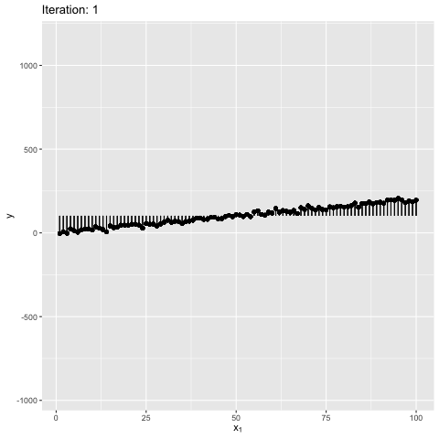

# 2.1. Linear Regression

## 2.1.1. Model definition

Linear regression model is used to predict a continuous outcome using a set of features. The model is defined as follows:

$$Y = XW + \epsilon$$

For the given sample $(X, y)$ from a non-random (fixed) design we need to estimate the weights $\hat{W}$. The standard way for estimating $W$ is using ordinary least squares (OLS). In this section we will examine OLS as a special case of MLE.

Let us assume that the true model is linear and it's form is known. Additionally, let us assume that the error is normally distributed with 0 mean and constant variance, defined by $\boxed{\epsilon \sim N(0, \sigma^2)}; \sigma^2 = constant$. Let us assume that we have training samples $\boxed{(X^{(i)}, y^{(i)}) \sim_{iid} (X, y)}$. Under these assumptions let us define the *estimates* for the sample as:

$$y = X\hat{W} + \hat{e} \implies \hat{e} = y - X \hat{W}$$

Frequentist approach to statistical inference assumes that the true population parameter $W$ is unknown. We are attempting to estimate $\hat{W}$ that closely represents the population parameter $W$. It is important to note that: a) $W$ is fixed and unknown, b) for a given type of estimation on a given data set $\hat{W}$ is fixed. We hope that $\hat{W}$ can be computed and it closely represents the population parameter $W$. Let us use the variable $w$ to denote the 'instantaneous' weight to avoid confusion. Under normality of errors and iid assumptions, we define the likelihood as a function of $w$ given by:

$$L(e; w) = \prod_{i=1}^{N} \bigg[\frac{1}{\sqrt{2 \pi \sigma^2}} exp\bigg(-\frac{(e^{(i)})^2}{2 \sigma^2}\bigg) \bigg]$$

We would like to maximize the likelihood by varying $w$. Since logarithm is a monotonous function of input and likelihood is non-negative (matches the domain of logarithm), the optima (maxima) of $log(L(e; w))$ and the optima (maxima) of $L(e; w)$ are attained at the same point given by $\hat{W}$. We can write the log-likelihood as:

$$l(e; w) = log(L(e; w)) = \sum_{i = 1}^{N}\bigg[\frac{1}{\sqrt{2 \pi \sigma^2}} \bigg] + \sum_{i = 1}^{N}\bigg[ \frac{- (e^{(i)})^2}{2 \sigma^2}\bigg]$$

Since $\sigma^2$ is constant, the only term that involves $w$ in $log(L(e; w))$ is the second term. Therefore, we have OLS as a special case of MLE as shown in equation $2.1.1.1$ below:

$$\DeclareMathOperator*{\argmax}{argmax} \DeclareMathOperator*{\argmin}{argmin} \hat{W} = \argmax \limits_{w} log(L(e; w)) = \argmax\limits_{w} \sum_{i=1}^{N}(- e^{(i)})^2 = \argmin\limits_{w} \sum_{i=1}^{N} (e^{(i)})^2 \tag{2.1.1.1}$$

## 2.1.2. Parameter estimation

### 2.1.2.1. Normal equations

Normal equations are obtained by setting the partial derivative of likelihood with respect to $w$ (Jacobian) to zero. Since logarithm is a monotonous transformation and likelihood function lies in the domain of logarithm, we can obtain the normal equations by setting the partial derivative of log-likelihood with respect to $w$ to zero.

$$\frac{\partial l(e; w)}{\partial w} = \frac{\partial log(L(e; w))}{\partial w} = 0 \implies \bigg[\frac{\partial}{\partial w} \sum_{i=1}^{N}(e^{(i)})^2 \bigg]_{w = \hat{W}} = 0 \tag{2.1.2.1.1.a}$$

Using clever linear algebra: $\sum_{i=1}^{N} (e^{(i)})^2 = e^Te$, substituting $e = y - Xw$, using $\frac{\partial e^Te}{\partial w} = 2 e^T \frac{\partial e}{\partial w} $ and substituting $\frac{\partial e}{\partial w} = -X$ into equation $2.1.2.1.1.a$, we get:

$$ -2 (y - X\hat{W})^T X = 0\tag{2.1.2.1.1.b}$$

Equating transpose of LHS and RHS:

$$X^T(y-XW) = 0 \implies X^Ty - X^TX\hat{W} = 0 \implies X^Ty = (X^TX)\hat{W}\tag{2.1.2.1.1.c}$$

$$\implies \hat{W} = (X^TX)^{-1}X^Ty \tag{2.1.2.1.2}$$

#### 2.1.2.1.1. Solving 'simple linear regression'

Simple linear regression is a special case of linear regression in which the number of independent variables is one. The interecept term is almost always included to correct for the residual bias (non-zero mean of the residue), because we assume that the residue accurately models the error term which is normally distributed with 0 mean and constant variance. A simple linear regression model and its corresponding sample esimtates are shown below:

$$Y = X_1 W_1 + W_0 + \epsilon; y = x_1 \hat{W_1} + \hat{W_0} + \hat{e}$$

For the sample, we can expand the system equation in terms of individual equations given by: $y^{(i)} = x_1^{(i)} \hat{W_1} + \hat{W_0} + \hat{e^{(i)}}$. Let us write this as a function of weights to solve for $(\hat{W_0}, \hat{W_1})$ that give the OLS solution. We have: $e^{(i)}(w_0, w_1) = (y^{(i)} - x_1^{(i)} w_1 - w_0)$. The OLS loss is given by: $L(w_0, w_1) = \sum_{i=1}^{N_{train}}[e^{(i)}(w_0, w_1)]^2$ with the solution given by

$$(\hat{W_0}, \hat{W_1}) = \argmin \limits_{(w_0, w_1)} L(w_0, w_1) = \argmin \limits_{(w_0, w_1)} l(w_0, w_1) = \argmin \limits_{(w_0, w_1)} \sum_{i=1}^{N_{train}} [y^{(i)} - x_1^{(i)} w_1 - w_0]^2$$

Using the same approach as normal equations, we set the partial derivative of $l(w_0, w_1)$ with respect to $w_0$ and $w_1$ to 0.

$$\bigg[\frac{\partial l(w_0, w_1)}{\partial w_0}\bigg]_{w_1 = \hat{W_1}, w_0 = \hat{W_0}} = \bigg[-2\sum_{i=1}^{N_{train}}(y^{(i)} - x_1^{(i)} w_1 - w_0)\bigg]_{w_1 = \hat{W_1}, w_0 = \hat{W_0}} = 0 \tag{2.1.2.1.1.0}$$

$$\implies \sum_{i=1}^{N_{train}} \hat{e}^{(i)} = N_{train} \bar{\hat{e}} = 0 \tag{2.1.2.1.1.1}$$

$$\implies \frac{1}{N_{train}}\sum_{i=1}^{N_{train}}y^{(i)} = \bar{\hat{y}} = \bar{y} - \bar{e} = \bar{y} = \frac{1}{N_{train}}\sum_{i=1}^{N_{train}}(x_1^{(i)}\hat{W_1} + \hat{W_0}) = \bar{x_1}\hat{W_1} + \hat{W_0} \tag{2.1.2.1.1.2}$$

$$\implies \hat{W_0} = \bar{y} - \hat{W_1}\bar{x_1} \tag{2.1.2.1.1.3}$$

From equation $2.1.2.1.1.1$ we infer that the average total residue is equal to zero, or on an average the model does not have a bias. It is because of this property that in deep learning courses we refer to the intercept as the 'bias term'. From equation $2.1.2.1.1.2$ we infer that the regression line always passes through the $(\bar{x_1}, \bar{y})$. This is a surprising result and will be used in an analogy in section 2.1.3. Let us continue with the solution:

$$\bigg[\frac{\partial l(w_0, w_1)}{\partial w_1}\bigg]_{w_1 = \hat{W_1}, w_0 = \hat{W_0}} = \bigg[-2\sum_{i=1}^{N_{train}}x_1^{(i)}(y^{(i)} - x_1^{(i)} w_1 - w_0)\bigg]_{w_1 = \hat{W_1}, w_0 = \hat{W_0}} = 0 \tag{2.1.2.1.1.4}$$

$$\implies \sum_{i=1}^{N_{train}} x_1^{(i)} y^{(i)} = \hat{W_1} \sum_{i=1}^{N_{train}} [x_1^{(i)}]^2 + N_{train} \hat{W_0}\bar{x_1} \tag{2.1.2.1.1.5}$$

Substituting equation $2.1.2.1.1.3$ in equation $2.1.2.1.1.5$:

$$\sum_{i=1}^{N_{train}} x_1^{(i)} y^{(i)} = \hat{W_1} \bigg[\sum_{i=1}^{N_{train}} [x_1^{(i)}]^2 - N_{train}[\bar{x_1}]^2 \bigg] + N_{train}\bar{x_1}\bar{y}$$

$$\implies \hat{W_1}  = \frac{\sum_{i=1}^{N_{train}} x_1^{(i)} y^{(i)} - N_{train}\bar{x_1}\bar{y}}{\sum_{i=1}^{N_{train}} [x_1^{(i)}]^2 - N_{train}[\bar{x_1}]^2} \tag{2.1.2.1.1.6}$$

Substituting equation $2.1.2.1.1.6$ in equation $2.1.2.1.1.3$:

$$\hat{W_0} = \bar{y} - \frac{\sum_{i=1}^{N_{train}} x_1^{(i)} y^{(i)} - N_{train}\bar{x_1}\bar{y}}{\sum_{i=1}^{N_{train}} [x_1^{(i)}]^2 - N_{train}[\bar{x_1}]^2}\bar{x_1} = \frac{\bar{y}\sum_{i=1}^{N_{train}} [x_1^{(i)}]^2 - N_{train}[\bar{x_1}]^2\bar{y} - \bar{x_1}\sum_{i=1}^{N_{train}} x_1^{(i)} y^{(i)} + N_{train}[\bar{x_1}]^2\bar{y}}{\sum_{i=1}^{N_{train}} [x_1^{(i)}]^2 - N_{train}[\bar{x_1}]^2}$$

$$\implies \hat{W_0} = \frac{\bar{y}\sum_{i=1}^{N_{train}} [x_1^{(i)}]^2 - \bar{x_1}\sum_{i=1}^{N_{train}} x_1^{(i)} y^{(i)}}{\sum_{i=1}^{N_{train}} [x_1^{(i)}]^2 - N_{train}[\bar{x_1}]^2} \tag{2.1.2.1.1.7}$$

We succeeded in deriving the solution in the hard way. Let's try an easier way:

Substituting equation $2.1.2.1.1.3$ in the estimation equation:

$$\hat{y^{(i)}} = \bar{y} + \hat{W_1}(x_1^{(i)} - \bar{x_1}) + \hat{e^{(i)}}$$

Let us try to estimate the term $\sum_{i=1}^{N_{train}} (y^{(i)}-\bar{y})(x_1^{(i)}-\bar{x_1})$:

$$\sum_{i=1}^{N_{train}} (y^{(i)}-\bar{y})(x_1^{(i)}-\bar{x_1}) = \sum_{i=1}^{N_{train}} \hat{W_1}(x_1^{(i)} - \bar{x_1})^2$$

$$\implies \hat{W_1} = 
\frac{\sum_{i=1}^{N_{train}} (y^{(i)}-\bar{y})(x_1^{(i)}-\bar{x_1})}{\sum_{i=1}^{N_{train}}(x_1^{(i)} - \bar{x_1})^2} \tag{2.1.2.1.1.8}$$

So how did we know the exact term $\sum_{i=1}^{N_{train}} (y^{(i)}-\bar{y})(x_1^{(i)}-\bar{x_1})$? Like most differential equations, without knowing the exact function to substitute, how do we arrive at the solution? Let's examine the term closely: $\sum_{i=1}^{N_{train}} (y^{(i)}-\bar{y})(x_1^{(i)}-\bar{x_1})$. Doesn't this term look familiar? Let's divide it by $N_{train} - 1$: $\frac{\sum_{i=1}^{N_{train}} (y^{(i)}-\bar{y})(x_1^{(i)}-\bar{x_1})}{N_{train} - 1}$. Does it look farmiliar now? Yes, the denominator is $N_{train} - 1$ times the sample covariance. Now guess what the denominator is. Correct, it is $N_{train} - 1$ times the sample variance of $x_1$. Therefore, equation $2.1.2.1.1.8$ can be rewritten as:

$$\hat{W_1} = \frac{cov(y, x_1)}{var(x_1)} = \frac{cor(y, x_1) sd(y) sd(x_1)}{[sd(x_1)]^2} = cor(y, x_1)\frac{sd(y)}{sd(x)}$$

#### 2.1.2.1.2. Writing a solver for linear regression

In this section we will try to write code to solve equation $2.1.2.1.2$. The first step in building a solver is to write code to multiply two matrices. We use the property that for matrices $A_{n \times m}, B_{m \times p}$, the product is given by $C_{n \times p} = AB \implies C_{i, k} = \sum_{j = 1}^{m} A_{i, j} * B_{j, k}$. The code for computing product of two matrices can be found below:

[C++ code for multiplying two matrices](data/multiply_matrices.cpp) **Bias alert: writing this just to prove that I can write C++ code for matrix multiplication**

The next objective is to invert a matrix. For this purpose we will use row/column reduction, also called Gauss-Jordan elimination or simply Gaussian elimination. We start from the property that for a square matrix $A$ that is invertible (assumed), we have $A^{-1}A = I$. In this property we will rearrange terms in the rows of $A$ to finally arrive at another property given by $A^{-1}I = A^{-1}$.

[C++ code for inverting a matrix](data/invert_matrix.cpp) **Bias alert: writing this just to prove that I can write C++ code for matrix inversion**

The code for finding analytical solution for linear regression can be found in section 2.1.2.2.3. The reader is recommended to go through section 2.1.2.2 to understand the reason for not providing the code here.

#### 2.1.2.1.3. Hierarchy rule

We noticed that the intercept term is always included in a linear regression model. Some may argue that the intercept is not required, and a simple linear regression model given by $Y = \beta X$ is sufficient. The hierarcy rule states that when a higher order term is used in an explanatory model, all the lower order terms that were used to generate the higher order term should be included in the model. This rule also applies to models that include higher order interactions. Therefore, when the number of variables is larger than 0, we always include the lower order term: $x^0 = 1$, which is the intercept. As seen in equation $2.1.2.1.1.1$ the intercept also adjusts for the residual bias, thereby making the mean of the residues (which is an estimate for the expected value of the error) to zero. This is one of the reasons for calling it the 'bias term'.

### 2.1.2.2. Computational complexity

Wikipedia defines [computational complexity](https://en.wikipedia.org/wiki/Computational_complexity) of an algorithm as the amount of resources required to run it. Computational complexity of matrix operations can be found in [this article](https://en.wikipedia.org/wiki/Computational_complexity_of_mathematical_operations#Matrix_algebra). But how is this calculated?

#### 2.1.2.2.1. Matrix multiplication

Consider two matrices $A_{n \times m}$ and $B_{m \times p}$. The product $C_{n \times p} = AB$ can be computed using the [matrix multiplication code](data/multiply_matrices.cpp). Looking at the loops used in the code (corresponding code block is shown below this paragraph) we find that the total number of operations is of the order $n \times m \times p$. Therefore the complexity (order) of matrix multiplication is $O(nmp)$.

<pre><code>NumericMatrix matrixMultiply(NumericMatrix A, NumericMatrix B) {
  ...
  for(i = 0; i < A.nrow(); i++) {
    for(j = 0; j < B.ncol(); j++) {
      for(k = 0; k < A.ncol(); k++) {
        C(i, j) += A(i, k) * B(k, j);
      }
    }
  }
  ...
  return(C);
}
</code></pre>

#### 2.1.2.2.1. Matrix inversion

Consider a square matrix $A_{n \times n}$. The inverse $A^{-1}_{n \times n}$ can be computed using the [matrix inversion code](data/invert_matrix.cpp). Looking at the loops used in the code (corresponding code block is shown below this paragraph) we find that the total number of operations is of the order $n \times n \times n$. Therefore the complexity (order) of matrix inversion is $O(n^3)$.

<pre><code>NumericMatrix invertMatrix(NumericMatrix x) {
  ...
  for(i = 0; i < x.nrow(); i++) {
    ...
    for(j = 0; j < x.nrow(); j++) {
      if(j != i) {
        row_num = x(j, i);
        for(k = 0; k < x.nrow(); k++) {
          x(j, k) -= (row_num * x(i, k));
          inv_x(j, k) -= (row_num * inv_x(i, k));
        }
      }
    }
  }
  ...
  return(inv_x);
}
</code></pre>

#### 2.1.2.2.3. Ordinary least squares (linear) regression

Substituting $X: N_{train} \times (p + 1)$, $X^T: (p + 1) \times N_{train}$, $y: N_{train} \times 1$ in equation $2.1.2.1.2$, we get the following computations:

- $X^TX: O(N_{train}(p + 1)^2)$
- $(X^TX)^{-1}: O((p + 1)^3)$

Now there are 2 choices for computation:

Choice 1:

- $[(X^TX)^{-1}X^T]: O(N_{train}(p + 1)^2)$
- $[(X^TX)^{-1}X^T]y: O(N_{train}(p + 1))$

Choice 2:

- $[X^Ty]: O(N_{train}(p + 1))$
- $(X^TX)^{-1}[X^Ty]: O((p + 1)^2)$

Addding the total number of computations, we have the computational complexity of the choices as:

- Choice 1: $O(2N_{train}(p + 1)^2 + (p + 1)^3 + N_{train}(p + 1))$
- Choice 2: $O(N_{train}(p + 1)^2 + (p + 1)^2 + (p + 1)^3 + N_{train}(p + 1))$

Comparing the choices we understand that for $N > 1$, $p > 0$ choice 2 is always more optimal. The exercise of finding computational complexity was performed to show that computational linear algebra is not just about mathematics. Careful choices need to be made to design efficient solutions to simple models. The need for performing such an analysis is more evident in more complex models.

[Header file with matrix operations as functions](data/linreg.h)

[C++ code for analytically solving linear regression](data/linreg_analytical.cpp) **Bias alert: writing this just to prove that I can write C++ code for solving normal equations**

The process of finding the total number of computations is the same in complex models such as support vector machines, neural networks, etc. For a linear regression model the choice is straight forward, but for a more complex model the choice may depend on other factors, for example: a) is $p > N_{train}$, b) hyperparameters such as the number of neurons in each layer, c) choice of kernel, etc. Customizing the *solver* may be the difference between training a neural network for years and arriving at the same solution for the same network in minutes. It is simply not enough for data scientists to use `from sklearn.linear_model import LinearRegression`, `lr = LinearRegression()`, and `lr.fit(X_train, y_train)` in Python or `model <- lm(y ~ x, data = train)` in R.

Of course, `sklearn` (Python) and `stats` (R) don't use normal equations because it is computationally expensive. They use methods that find an approximate solution and have much lower computational complexity.

## 2.1.3. Simple linear regression and some physics: an analogy

## 2.1.3.1. An analogy

From equation $2.1.2.1.1.3$ we know that a simple linear regression line always passes through $(\bar{x_1}, \bar{y})$. This is not surprising because if we don't have predictors our best guess for the outcome is $\hat{y} = \bar{y}$ (OLS solution for for $p = 0$, also the maximum likelihood estimate on the sample for the model $Y = f(1) + \epsilon$ where $\epsilon \sim_{iid} N(0, \sigma^2)$, f is a linear function, and $f(1)$ does not depend on $X$). Let us assume that we don't know the OLS solution and try to understand it by studying the behavior of different 'lines' that pass through $(\bar{x_1}, \bar{y})$. This system is parameterized by the instantaneous slope $w_{1}$, the instantaneous intercept $w_0$ gets adjusted automatically on determining $w_{1}$

Let us imagine the following:

1. The instantaneous estimated line is a one dimensional beam of uniform mass density that is hinged at $\bar{x_1}$ and is free to rotate in $x_1, y$ plane
2. The instantaneous residue $e^{(i)}$ is the equivalent of a force. Magnitude of the residue and its sign determine the magnitude of the force and direction respectively, $F^{(i)} \propto e^{(i)}$
3. The $i^{th}$ force act a locations with respect to the hinge given by $x_1^{(i)} - \bar{x_1}$. Therefore, it is possible to define the individual torque caused by the $i^{th}$ force as $\tau^{(i)} = (x_1^{(i)} - \bar{x_1})e_{(i)}$ (anticlockwise direction is positive)
4. Moment of inertia is given by $I \propto (max(x_1) - min(x_1))^2$

Let us start with $w_0 = 0$, therefore we have $e^{(i)} = y^{(i)} - \bar{y}$. At the initial position the net force and net torque on the 'beam' are given by:

$$F(w_1 = 0) = \sum_{i = 1}^{N_{train}} e^{(i)}(w_1 = 0) = \sum_{i = 1}^{N_{train}} (y^{(i)}-\bar{y}) = \sum_{i = 1}^{N_{train}} y^{(i)} - N_{train}\bar{y} = 0$$

$$\tau \propto \sum_{i = 1}^{N_{train}} (x_1^{(i)} - \bar{x_1})e^{(i)}$$

Now let us use the net force and net torque to simulate the motion of the system for a period of time starting from $w_1 = 0$:

[R code to generate plot](data/linreg_physics.R)

**Note: Moment of inertia is not exact. A scaling factor called `control_inertia` was used to speed up or slow down the animation**

We observe that the net force on the beam is always zero. For the initial position the net torque is in anticlockwise direction, which forces the slope of the line to increase. The beam gains angular momentum in anticlockwise, but the net torque keeps decreasing, reaches zero and changes direction. This leads to decrease in angular momentum in anticlockwise. After some time the angular momentum is zero, and the net torque is in clockwise direction. This forces the bean to rotate in clockwise direction. The motion continues till the initial position. The dynamics look similar to a pendulum where the total energy is conserved.

We also observe that the beam is in *stable equilibrium* about a specific position. However, for the given initial position $\theta = 0$ the reason for having a high maximum slope is unclear. This happens because $tan$ function is not anti-symmetric about the solution ($tan(\theta) \sim 2$). It is important to note that the code manipulates the angle directly, and not the slope - therefore, this behavior is expected. The behavior becomes more understandable when the value of $W_1$ in true model is updated to 0, as shown below. Can you guess why? It's because $w_1 = tan(\theta) \to \theta$ for small $\theta \sim 0$. This property is violated for large values of $\theta$.

*A close examination of how the above system works:* If $\hat\theta \to 0$, and the maximum perturbation is small, we have $tan(\theta) = w_1 \to \theta$ for any instantaneous value of $\theta$. Note that we are not concerned about $w_0$ because $w_0$ is automatically determined as we constrained the line to pass through $(\bar{x}, \bar{y})$. Therefore, we have $\frac{\partial \sum_{i=1}^{N}(e^{i})^2}{\partial w_1} \to \frac{\partial \sum_{i=1}^{N}(e^{i})^2}{\partial \theta}$. In short, manipulating $\theta$ is equivalent to manipulating $w_1 \to \theta$ directly. This is not true in the previous case because for large values we have $tan(\theta) >> \theta$

From equation $2.1.2.1.1.4$ we can infer that for the OLS estimate the net torque (first moment) about the origin is zero. By subtracting $0 = \bigg[\sum_{i=1}^{N_{train}}\bar{x_1}(y^{(i)} - x_1^{(i)} w_1 - w_0)\bigg]_{w_1 = \hat{W_1}, w_0 = \hat{W_0}}$ from equation $2.1.2.1.1.4$ we observe that the net torque (first moment) about $\bar{x_1}$ is zero. Therefore, the regression estimate is a position of zero net force and zero torque - the position of stable equilibrium for the imaginary system. For the special case where $\hat\theta \to 0$ the diagram resembles the behavior of **gradient descent** in which the rate of change of *momentum* is determined by the (negative) gradient. Regular gradient descent does this differently - rate of change of *position* is determined by the (negative) gradient. The learning rate can be considered as inverse of inertia. We will discuss this in more detail in section 2.1.4.

For OLS linear regression we can understand the normal equations as a system of equations that have zero net moment. Setting the zero-th moment to zero gives the first equation, which suggests that the sum of the residues should be equal to zero. Setting the first moment to zero gives the second equation, which suggests that residue is independent of the independent variables. This result will also be discussed in a later section <> about the geometric interpretation of linear regression.

## 2.1.3.2. Computational complexity of the above analogy

We note that we have fixed $p=1$ for the purposed of visualization. Let us generalize it to an arbitrary number $p$ again for finding the computational complexity. In each iteration we did the following number of computations:

- pred_y_inst(t): $N_{train} + N_{train} p$
- $residuals(t): N_{train}$
- $force(t): N_{train}$
- $torque(t): N_{train} p$
- $\frac{\partial^2 \theta}{\partial t^2}(t): p$
- $\frac{\partial \theta}{\partial t}(t): p$
- $\theta(t): p$
- $w_1(t + 1): p + 1$
- $w_0(t + 1): N_{train} + N_{train} p$

## 2.1.4. Extending the ideas from physics: gradient descent

We noted that the computational complexity of solving the normal equations is $O(N_{train}(p + 1)^2 + (p + 1)^2 + (p + 1)^3 + N_{train}(p + 1))$. Looking back at the previous section we found a way to oscillate around the solution with a much lower computational complexity of $O(4 N_{train} + 3 N_{train} p + 4 p + 1)$ per iteration because $p$ is typically large enough to offset the effect of constant terms in the order of complexity. Performing small number of such iterations to get closer to the solution that has zero net moment is almost always a better choice compared to solving the normal equations.

Gradient descent is a popular algorithm for parameter estimation. It differs from the physics analogy in section 2.1.3.1. in a subtle way: consider the gradient as a direct indicator of rate of change of weight (angle in the analogy because $w_1 \to \theta$):

$$w(t + 1) := w(t) - \alpha \bigg[\frac{\partial l}{\partial w}\bigg]_{w = w(t)}$$

Here $\alpha$ is called the learning rate. It determines how quickly (number of iterations) we can reach a solution that is close to the OLS estimate. However, setting it to a high value can have an undesirable effect on the learning. Let us understand simple linear regression through mathematics.

### 2.1.4.1. Convergence of gradient descent for linear regression

For this section let us assume that the covariance matrix is invertible. In other words $(X^TX)^{-1}$ exists.

$$l(w(t)) = \bigg(y - Xw(t)\bigg)^T\bigg(y - Xw(t)\bigg)$$

$$l(w(t + 1)) = \bigg[y - X\bigg(w(t) - \alpha \bigg[\frac{\partial l}{\partial w}\bigg]_{w = w(t)}\bigg) \bigg]^T \bigg[y - X\bigg(w(t) - \alpha \bigg[\frac{\partial l}{\partial w}\bigg]_{w = w(t)}\bigg) \bigg]$$

$$\implies l(w(t + 1)) = \bigg[y - Xw(t) + \alpha X\bigg[\frac{\partial l}{\partial w}\bigg]_{w = w(t)}\bigg]^T \bigg[y - Xw(t) + \alpha X\bigg[\frac{\partial l}{\partial w}\bigg]_{w = w(t)}\bigg]$$

$$\begin{eqnarray}
\implies l(w(t + 1)) = l(w(t)) + \alpha \bigg(y - Xw(t)\bigg)^T X\bigg[\frac{\partial l}{\partial w}\bigg]_{w = w(t)}  + \alpha \bigg(X\bigg[\frac{\partial l}{\partial w}\bigg]_{w = w(t)}\bigg)^T \bigg(y - Xw(t)\bigg) \nonumber \\
+ \alpha^2 \bigg(X\bigg[\frac{\partial l}{\partial w}\bigg]_{w = w(t)}\bigg)^T \bigg(X\bigg[\frac{\partial l}{\partial w}\bigg]_{w = w(t)}\bigg)  \tag{2.1.4.1.1}
\end{eqnarray}$$

In equation $2.1.4.1.1$ we observe that the second and third term are transpose of each other and they are scalars (can be proved by matching dimensions of matrix multiplication or by looking at the terms that are added: $l(w(t))$, which is a scalar). The transpose of a scalar is itself, therefore both the values are equal. Now we assume the following in equation $2.1.4.1.1$:

- $\alpha > 0$ is small and the gradients are small enough that the step size is not large, i.e. $w(t+1)$ will be in the neighborhood of $w(t)$

- $\implies \alpha^2 \lVert X [ \frac{\partial l}{\partial w} ]_{w = w(t)}\rVert _2^2 \to 0$

- We assume this condition is met $\forall w(t) \in R^{p + 1}$, $X \in R^{N_{train} \times (p + 1)}$

$$l(w(t + 1)) = l(w(t)) + 2\alpha \bigg(y - Xw(t)\bigg)^T X\bigg[\frac{\partial l}{\partial w}\bigg]_{w = w(t)} \tag{2.1.4.1.2}$$

Substituting equation $2.1.2.1.1.c$ in equation $2.1.4.1.2$ we get:

$$l(w(t + 1)) = l(w(t)) + 2\alpha \bigg(y - Xw(t)\bigg)^T X \bigg(-2X^T\bigg(y - Xw(t)\bigg) \bigg)$$

$$\implies l(w(t + 1)) = l(w(t)) - 4\alpha \bigg(y - Xw(t)\bigg)^T X X^T \bigg(y - Xw(t) \bigg)$$

Sequentially transforming the above equation, we get:

- $A = X^T\bigg(y - Xw(t)\bigg) \implies A^T = \bigg[X^T \bigg(y - Xw(t)\bigg)\bigg]^T = \bigg(y - Xw(t)\bigg)^T\bigg[X^T\bigg]^T = \bigg(y - Xw(t)\bigg)^TX$

- $dim(A) = p \times 1 \implies dim(A^T) = 1 \times p; dim(A^TA) = 1 \times 1; A^TA = \lVert A \rVert_2^2$

$$\implies l(w(t + 1)) = l(w(t)) - 4 \alpha \bigg|\bigg|X^T\bigg(y - Xw(t)\bigg)\bigg|\bigg|_2^2 \le l(w(t))$$

Therefore, for a sufficiently small $\alpha$ we observe that $l(w)$ is a non-increasing function. Also, $l(w)$ is lower bounded by 0 because it is a 2-norm. Therefore, gradient descent theoretically converges to at least a local minima for OLS linear regression. However, this is true only under the assumption that $X^TX$ is invertible. The effects of non-invertibility of the covariance matrix will be discused in section <>.

**Additional note:** We observe that $\frac{\partial l}{\partial w} = -2X^T(y-Xw)$, which is proportional to A. Therefore, the loss stops decreasing when the 2-norm of the gradient tends to zero. By default this is the first order condition for normal equations at global optima. However, this condition alone does not guarantee the convergence of gradient descent to global optima.

### 2.1.4.2. Writing a solver for linear regression using gradient descent

From the above analysis we understand that pre-computing the residues and reusing them for calculation of gradient and loss can reduce the amount of computation. The total computational complexity per iteration is $O(4N_{train}(p+1) + 6(p+1))$ (not the most optimal because explicit computation of transpose can be avoided by writing a function to directly compute $X^Te$). For a small number of iterations this is a tremendous improvement over the normal equations approach!

[C++ code for solving linear regression using gradient descent](data/linreg_GD.cpp) **Bias alert: writing this just to prove that I can write C++ code for gradient descent**

### 2.1.4.3. Nature of OLS regression loss function

Let us assume that the covariance matrix is invertible. From undergrad optimization courses we understand that convexity is an important property for a minimization problem. Let us try to understand whether the loss function is convex. For this section let us consider a linear regression model $Y = XW + \epsilon$ that is estimate using $\hat{y} = X\hat{W} + \hat{e}$. For simplicity let us use the result from equation $2.1.2.1.1.3$ is valid for multiple linear regression - therefore, the regression line will always pass through $(\bar{X}, \bar{y})$ for any instantaneous value of $w$. Also, for a given dataset $[(X^{(i)}, y^{(i)})]$, the current value of loss is a function of $w$ (instantaneous value, not the estimate).

$$l(w) = (y - Xw)^T (y - Xw) = y^Ty - y^T Xw - (Xw)^Ty + (Xw)^T Xw \tag{2.1.4.3.1}$$

In equation $2.1.4.3.1$ the second and third term are scalar and are transpose of each other, and are therefore equal

$$\implies l(w) = y^Ty + w^TX^TXw - 2w^TX^Ty$$

Let us sample two arbitrary points $w(1), w(2)$ (not related to iterations 1 and 2 of gradient descent). Any point $w(3)$ between $w(1)$ and $w(2)$ can be written as a convex combination $w(3) = \alpha w(1) + (1-\alpha) w(2); \alpha \in (0, 1)$

$$l(w(1)) = y^Ty + w(1)^TX^TXw(1) - 2w(1)^TX^Ty$$

$$l(w(2)) = y^Ty + w(2)^TX^TXw(2) - 2w(2)^TX^Ty$$

$$l(w(3)) = y^Ty + \bigg(\alpha w(1) + (1 - \alpha)w(2)\bigg)^TX^TX\bigg(\alpha w(1) + (1 - \alpha)w(2)\bigg) - 2\bigg(\alpha w(1) + (1 - \alpha)w(2)\bigg)^TX^Ty$$

$$\begin{eqnarray}
\implies l(w(3)) - (\alpha l(w(1)) + (1-\alpha) l(w_2)) = y^Ty +\alpha^2 w(1)^T X^TXw(1) - 2 \alpha w(1)^TX^Ty - 2(1-\alpha)w(2)^Ty \nonumber \\
+ (1-\alpha)^2 w(2)^T X^TXw(2) +
\alpha(1-\alpha) w(2)^TX^TXw(1) + \alpha(1-\alpha)w(1)^TX^TXw(2) \nonumber \\ -\alpha\bigg( y^Ty  + w(1)^TX^TXw(1) - 2w(1)^TX^Ty \bigg) - (1 - \alpha) \bigg( y^Ty + w(2)^TX^TXw(2) - 2w(2)^TX^Ty \bigg) \tag{2.1.4.3.2}
\end{eqnarray}$$

In equation $2.1.4.3.2$ we observe terms 6 and 7 are scalars and are transpose of each other, and are therefore equal

$$\begin{eqnarray}
\implies l(w(3)) - (\alpha l(w(1)) + (1-\alpha) l(w_2)) = \alpha^2 w(1)^TX^TXw(1) + (1-\alpha)^2 w(2)^TX^TXw(2) \nonumber \\
+ 2\alpha(1-\alpha)w(1)^TX^TXw(2) - \alpha w_1^TX^TXw_1 - (1-\alpha) w_2^TX^TXw_2 \nonumber \\
= (\alpha^2-\alpha)w(1)^TX^TXw(1) + ((1-\alpha)^2-(1-\alpha))w_2^TX^TXw_2 + 2\alpha(1-\alpha)w(1)^TX^TXw(2) \nonumber \\
= -\alpha(1-\alpha)w(1)^TX^TXw(1) -\alpha(1-\alpha)w_2^TX^TXw_2 + 2\alpha(1-\alpha)w(1)^TX^TXw(2) \tag{2.1.4.3.3}
\end{eqnarray}$$

In equation $2.1.4.3.3$ we observe that the last term is a scalar, therefore its value is the same as its transpose. The complete last term can also be written as $\alpha(1-\alpha)w(1)^TX^TXw(2) + \alpha(1-\alpha)w(2)^TX^TXw(1)$

$$\begin{eqnarray}
\implies l(w(3)) - (\alpha l(w(1)) + (1-\alpha) l(w_2)) \nonumber \\
= -\alpha(1-\alpha)\bigg[w(1)^TX^T\bigg(X(w(1)-w(2))\bigg) - w(2)^TX^T \bigg(X(w(1)-w(2))\bigg) \bigg] \nonumber \\
= -\alpha(1-\alpha)\bigg[ \bigg(X(w(1)-w(2))\bigg)^T \bigg(X(w(1)-w(2))\bigg) \bigg] \nonumber \\
= -\alpha(1-\alpha)\bigg\lVert X(w(1)-w(2)) \bigg\rVert_2^2 \tag{2.1.4.3.4}
\end{eqnarray}$$

We know that $\alpha(1-\alpha) \in (0, 0.25) \forall \alpha \in (0,1)$. Therefore, the resulting term is always non-positive. From normal equations it is known that the solution is unique for an invertible covariance matrix. Therefore, for $w(1) \neq w(2)$ such that $w(1) \in R^{(p+1)\times 1}, w(2) \in R^{(p+1)\times 1}$ we have $l(w(3)) - (\alpha l(w(1)) + (1-\alpha) l(w_2)) \le 0$ where $w(3)$ is a convex combination of $w(1), w(2)$, and equality is attained only when $w(1) = w(2)$. Therefore, the OlS linear regression loss function is convex (For $z(3) \in (z(1), z(2))$ such that $w(3) = \alpha w(1) + (1-\alpha)w(2), \alpha \in (0,1)$, if we have $f(w(3)) < \alpha f(w(1)) + (1-\alpha)f(w(2))$ then $f$ is a convex function)

Combining results across sections 2.1.2.1, 2.1.4.1 and 2.1.4.3: Consider OLS linear regression estimation on a data set with invertible covariance matrix. We know from normal equations that the estimated weight vector is unique. For such a case we know two results: 1) the loss function decreases as long as the gradient with respect to weights is non-zero, 2) the loss function is convex with respect to the weights. Combining these results we conclude that for the given data set gradient descent will asymptotically converge to global optima for a suitably chosen small learning rate $\alpha$. The first order optimality condition (weights are unconstrained) will be met at the global optima: $\bigg[\frac{\partial l}{\partial w}\bigg]_{w=\hat{W}} = \vec{0}$.

### 2.1.5. Issues with gradient descent

Learning rate is a hyperparameter in linear regression solved using gradient descent. Choosing a suitable learning rate ($\alpha$) for gradient descent is not trivial, which is a major drawback of gradient descent. A very high learning rate will lead to divergence of weights. A very low learning rate will lead to slow convergence. It is important to note that the choice of learning rate also depends on the scale of the data set (derivative depends on $X, y$). Standard steps are followed to fix these issues: both $X$ and $y$ are standardized to have $mean=0$ and $variance=1$ (a.k.a. [batch normalization](https://en.wikipedia.org/wiki/Batch_normalization)). Also, modern packages for machine learning and deep learning such as [scikit-learn](https://scikit-learn.org/stable/), [Tensorflow](https://www.tensorflow.org/), [PyTorch](https://pytorch.org/), etc. have standard set of learning rates and allow user defined learning rate schedulers to alleviate this problem. However, standard recipes still don't solve all problems.

### 2.1.5.1. Extensions: Newton's method

For a function $f$ of $w \in R^{1}$ that is minimized at $\hat{w}$ we know that $\bigg[\frac{\partial^2 f}{\partial w^2}\bigg]_{w=\hat{w}} > 0$. Differentiating equation $2.1.2.1.1.b$ with respect to $W^T$ we get:

$$\bigg[\frac{\partial^2 l}{\partial W\partial W^T}\bigg]_{W = \hat{W}} = 2 X^T X$$

This is called the Hessian matrix. We observe that for the chosen data set (invertible $X^TX$) the Hessian is a positive (semi)-definite matrix at the optimal solution. This is the necessary second order condition for optimality. Interestingly if the Hessian at every weight $w$ is invertible, we can use the first and second order optimality conditions together to avoid choosing a learning rate. This is achieved using Newton's method.

If the Hessian is denoted by $H(w)$ and Jacobian is denoted by $J(w)$, then the Newton update without considering step size ([also refer this link](https://en.wikipedia.org/wiki/Newton%27s_method_in_optimization#Higher_dimensions)), without any change in first or second order optimality conditions, is given by:

$$w(t+1) = w(t) - \bigg(H(w(t))\bigg)^{-1}J(w(t))$$

Adding a step size parameter to satisfy Wolfe's condition ([refer this](https://en.wikipedia.org/wiki/Wolfe_conditions)) the update is given by:

$$w(t+1) = w(t) - \gamma \bigg(H(w(t))\bigg)^{-1}J(w(t)); \gamma \in (0, 1]$$

We observe that the convergence is independent of the scale of $X$ (inverse Hessian or inverse covariance removes the dependence), but depends on the scale of $y$ (through the Jacobian). Therefore, Newton's method tends to converge to a reasonable solution in finite number of steps without manual choice of learning rate. However, it is important to note that Newton's method, despite being an iterative method, introduces all issues that were present in the analytical solution using normal equations.

[C++ code for solving linear regression using Newton's method](data/linreg_Newton.cpp) **Bias alert: writing this just to prove that I can write C++ code for Newton's method**

### 2.1.5.2. Extensions: Coordinate descent

Let us assume that the design matrix is orthogonal. Therefore, the covariance matrix will be a diagonal matrix.

$$
\begin{equation}
H(w)_j^{(i)} =
\begin{cases}
    H_i^{(i)}\neq 0 & \text{if } i = j\\
    0 & \text{otherwise}
\end{cases}
\end{equation}$$

$$
\begin{equation}
H^{-1}(w)_j^{(i)} =
\begin{cases}
    \frac{1}{H_i^{(i)}} & \text{if } i = j\\
    0 & \text{otherwise}
\end{cases}
\end{equation}$$

Assuming all the independent variables have variance, Newton's update ($\gamma = 1$) given by: $w(t+1) = w(t) - \bigg(H(w(t))\bigg)^{-1}J(w(t))$ is equivalent to taking scaled steps individually along each of the weight axes. This is similar to profile likelihood approach for parameter estimation, where the parameters that are not important are profiled out. Specifically, this resembles a scenario in profile likelihood where the parameters are independent - similar to mean and variance of a normal distribution. This suggests that the loss function can be projected along each of the weight axes and minimization can be done along each weight axis independently without considering the effects of change in another weight. The overall solution is obtained by concatenating the optimal solution along each individual weight axis. In the ideal scenario described above where the covariance matrix is a diagonal matrix, coordinate descent will converge after a single sweep of projected optimization along each of weight axes.

<pre id="coordinateDescent" style="display:hidden;">
    \begin{algorithm}
    \caption{Coordinate descent applied to linear regression}
    \begin{algorithmic}
    \FUNCTION{linregCoord}{$X, y, tolerance, maxIter$}
        \STATE $iter = 0$
        \STATE $p = $ \CALL{numberOfColumns}{$X$}
        \STATE $w = $ \CALL{initializeRandomly}{$p$}
        \STATE $X^TX_{diag} = $ \CALL{sumSquaresColumns}{$X$}
        \STATE $Loss_{prev} = Loss_{next} = 1$
        \STATE $tol = tolerance + 1$
        \WHILE{$tol > tolerance$ \AND $iter < maxIter$}
            \STATE $Loss_{prev} = $ \CALL{calculateLoss}{$y, X, w$}
            \FOR{$j = 0$ \TO $p - 1$}
                \STATE $w_{-j} = $ \CALL{dropJthRow}{$w, j$}
                \STATE $X_{-j} = $ \CALL{dropJthColumn}{$X, j$}
                \STATE $yhat_{-j} = $ \CALL{matrixMuliply}{$X_{-j}, w_{-j}$}
                \STATE $res_{-j} = $ \CALL{vectorDifference}{$y, yhat_{-j}$}
                \STATE $X_j = $ \CALL{chooseJthColumn}{$X, j$}
                \STATE $X_j^T = $ \CALL{transpose}{$X_j$}
                \STATE $X_j^Tres_{-j} = $ \CALL{matrixMuliply}{$X_j^T, res_{-j}$}
                \STATE $w_{j} = \frac{X_j^Tres_{-j}}{[X^TX_{diag}]_j}$
            \ENDFOR
            \STATE $Loss_{next} = $ \CALL{calculateLoss}{$y, X, w$}
            \STATE $tol = \bigg| \frac{Loss_{prev}}{Loss_{next}} -1 \bigg|$
            \STATE $iter = iter+1$
        \ENDWHILE
        \RETURN $w$
    \ENDFUNCTION
    \end{algorithmic}
    \end{algorithm}
</pre>

[C++ code for solving linear regression using coordinate descent](data/linreg_coord.cpp) **Bias alert: writing this just to prove that I can write C++ code for coordinate descent**

It is important to note that coordinate descent is very similar to Newton's method. There are two differences:

1. Typical gradient based methods such as gradient descent and Newton's method that update all weights simultaneously. However, coordinate descent updates one weight at a time
2. Newton's method resorts to inversion of the Hessian matrix. Coordinate descent (loosely written) approximates the Hessian as a diagonal matrix and uses the sum of squares to solve for the weights, assuming the weights to be orthogonal

The second difference gives us a way to optimize coordinate descent for *simple linear regression*: if $x_1$ is recentered to zero mean, $x_0^Tx_1 = \sum_{i=1}^{N_{train}}{x_1^{(i)}} = N_{train}\bar{x_1} = 0$, which ensures orthogonality. Therefore, coordinate descent will converge to optimal solution in one iteration (second iteration is run just to check for convergence). However, the intercept is computed based on recentered $x_1$, and is therefore adjusted as shown in the last section of the [code](data/linreg_coord.cpp).

This simple linear regression example suggests that centering all independent variables can make coordinate descent converge faster for any value of $p$, but it is known that adjusting the center does not change the correlation between the independent variables. It is easy to assume that the center can be sequentially adjusted to have all pairs of $x_{j}^Tx_k = 0 \forall j \neq k$, but this is not possible unless all pairs of independent variables are uncorrelated. Secondly, if we consider two independent variables that are perfectly correlated, the first (in order of weight update) variable will capture all the weight and the second variable will receive a weight of 0. However, linear regression is supposed to have indeterminate solution for this case. Coordinate descent is not capable of identifying this issue.

### 2.1.5.3. Extensions: gradient computation using finite difference method

The sum of squares loss is a relatively simple loss function to differentiate with respect to the parameters. But let us analyze the computational complexity of two operations for a given set of weights (may not be optimal): exact gradient computation and prediction + error computation. The complexity of exact gradient computation is $O(N_{train}(p+1) + N_{train} + N_{train}(p+1))$. The complexity of prediction is $O(N_{train}(p+1))$, and the additional complexity of error computation is $O(N_{train})$. Now let us recall the forward difference approach for computing gradient with respect to a variable $w_j$:

$$\bigg[\frac{\partial L}{\partial w_j}\bigg]_{w_j = w_j(t)} = \lim_{h \to 0} \frac{L(w_j = w_j(t) + h, w_{-j}) - L(w_j = w_j(t), w_{-j})}{h} \approx \frac{L(w_j = w_j(t) + \delta h, w_{-j}) - L(w_j = w_j(t), w_{-j})}{\delta h}$$

For computing this for each of the weights we need to perform $p+1$ operations, each of which have a complexity of $O(2(N_{train}(p+1) + N_{train}))$ as discussed above. This operation seems to be slightly more expensive than computing the analytical gradient for linear regression. However, the finite difference approach becomes computationally more efficient if the gradient computation is very expensive compared to prediction + loss computation. Even if the computational efficiency is poor, numeric gradient computation is often used to check the accuracy of computed analytical gradient. This is because humans are prone to errors, and may miss constants or negative sign while coding the analytical gradient, whereas finite difference method gives a *near* fool-proof way for computing the gradient with respect to any weight (for example: in any layer for a neural network).

[C++ code for solving linear regression using gradient descent and forward difference gradient](data/linreg_GD_finite_difference.cpp) **Bias alert: writing this just to prove that I can write C++ code for gradient descent and forward differnece**

### 2.1.5.4. Extensions: stochastic / mini-batch gradient descent

Let us look at the following relationship for a loss function that is continuously differentiable:

$$E[\frac{\partial l}{\partial w}] = \frac{\partial E[l]}{\partial w}$$

In simple words, if the sample $(x^{(i)}, y^{(i)}) \sim_{iid} (X, Y)$ the expected direction of the gradient over a batch is given by the gradient of the expected loss over the sample. This leads to a powerful result: the gradient computed from a data point is an unbiased estimator of the gradient computed from a batch. Therefore, each iteration of gradient descent can be simplified computationally by computing the loss and gradient with respect to a single data point instead of computing over the entire batch of size $N_{train}$.

However, unbiased behavior of the gradient calculated using a single data point does not ensure convergence. It must be noted that the estimate of gradient using a single data point is noisy (it is also a statistic) - it has a large variance. Assuming an iid sample (achieved in practice by randomizing the sample used for computing loss and gradient in each iteration), the variance is given by $N_{train} \sigma^2$, where $\sigma^2$ is the variance of the estimate computed using the entire batch (which is also a statistic). If this noisy estimate is assumed to be a random variable, the expectation does not change if a new statistic is derived by averaging over a sample of size $N_{mini-batch}$. Howwver, the variance of the averaged estimate will be $\frac{1}{N_{mini-batch}}$ times the variance of the SGD estimate. This approach is known as mini-batch gradient descent. Therefore, the variance of mini-batch gradient is given by $\frac{N_{train}}{N_{mini-batch}} \sigma^2$.

<pre id="MBGD" style="display:hidden;">
    \begin{algorithm}
    \caption{Mini-batch gradient descent applied to linear regression}
    \begin{algorithmic}
    \FUNCTION{linregMBGD}{$X, y, N_{MB}, maxIter, lr$}
        \STATE $iter = 0$
        \STATE $p = $ \CALL{numberOfColumns}{$X$}
        \STATE $N_{train} = $ \CALL{numberOfRows}{$X$}
        \STATE $w = $ \CALL{initializeRandomly}{$p$}
        \WHILE{$iter < maxIter$}
            \STATE $mb_{idx} = $ \CALL{sampleMiniBatch}{$[0, N_{train})$}
            \STATE $X_{MB}, y_{MB} = $ \CALL{getMiniBatch}{$X, y, mb_{idx}$}
            \STATE $Loss = $ \CALL{calculateLoss}{$y_{MB}, X_{MB}, w$}
            \STATE $grad = $ \CALL{computeGradient}{$X_{MB}, y_{MB}, w$}
            \STATE $w = w - lr * grad$
            \STATE $lr = $ \CALL{learningRateSchedule}{$lr, iter$}
            \STATE $iter = iter+1$
        \ENDWHILE
        \RETURN $w$
    \ENDFUNCTION
    \end{algorithmic}
    \end{algorithm}
</pre>

For a fixed learning rate stochastic gradient descent is not expected to converge. However, if the learning rate gradually reduces to 0 at the limit ($n_{iter} \to \infty$), it may be possible to achieve convergence of SGD to a local/global optima under certain conditions. It is important to notice that reducing the learning rate to 0 leads to convergence, but the point is not necessarily a local/global optima (first order condition may not be met).

## 2.1.6. Prediction

Prediction using a linear regression model is straight forward: for a model $Y = X\beta + \episilon$, where the sample estimate is given by $y = X \hat{\beta} + \hat{e}$, we obtain the predictions as:

$$\hat{y}_{test} = X_{test}\hat{\beta}$$

## 2.1.7. Bias and variance

### 2.1.7.1. Bias of $\hat{\beta}$

### 2.1.7.2. Variance of $\hat{\beta}$

### 2.1.7.3. Bias of $\hat{y}$

### 2.1.7.4. Variance of $\hat{y}$

## 2.1.8. Special properties

$$\hat{y} = X\hat{\beta} = X(X^TX)^{-1}X^Ty$$

Let us define the hat matrix as $H = X(X^TX)^{-1}X^T$, then we:

$$\hat{y} = Hy; \hat{e} = y - \hat{y} = (I - H)y \tag{2.1.8.1}$$

Clearly, H is a square matrix. Let us examine $H$ closely:

$$H^T = (X(X^TX)^{-1}X^T)^T = (X^T)^T[(X^TX)^{-1}]^T X^T = X[(X^TX)^T]^{-1}X^T = X[X^T(X^T)^T]^{-1}X^T = X(X^TX)^{-1}X^T = H$$

From equation $2.1.8.1$ and the definition of $H$ we have: $X^T\hat{y} = X^TX(X^TX)^{-1}X^Ty = X^Ty$, which is also evident from $X^T\hat{e} = 0$ derived using first order optimality condition.

**More properties:**

- $(I - H)^T = I^T - H^T = I - H$
- $H^2 = HH = X(X^TX)^{-1}X^TX(X^TX)^{-1}X^T = X(X^TX)^{-1}X^T = H$
- $(I-H)^2 = (I-H)(I-H) = I^2 - IH - HI + H^2 = I - 2H + H = I - H$

## 2.1.9. Model assumptions

Let us recap the assumptions in this section:

1. The model is linear: variables may be transfored to incorporate non-linear effects, but the model is linear with respect to the coefficients. Example: $Y = \beta_0 + \beta_1 X_1 + \beta_2 X_1^2$ is a linear model with independent variables $(X_1, X_1^2)$
2. The error is *normally distributed* with *zero* mean and *constant variance* that is independent of $X$: this statement often causes misinterpretation. One common misinterpretations is that the independent variables should be normally distributed (mentioned in "The story of normality of ... independent variables in linear regression" section of [introduction](introduction.md))
    a. No heteroskedasticity: variance of the error is independent of X and is constant throughout. A weaker form is: $\hat{\sigma}^2$ is approximately the same over the range of independent variables $X$
3. The sample covariance matrix is invertible. In other words, the independent variables don't exhibit high levels of multicollinearity
4. No 'autocorrelation'; the errors are independent
    a. A weaker form is: 'lagged' residue terms are not strongly correlated

**Note:**

1. In the above definition of the model there is no uncertainty in the measurement of independent variables. However, it is possible to accommodate for uncertainties in $X$ in linear regression
2. More special properties can be derived if the distribution of independent variables is multivariate normal. However, this condition is not necessary for the validity of a linear regression model

