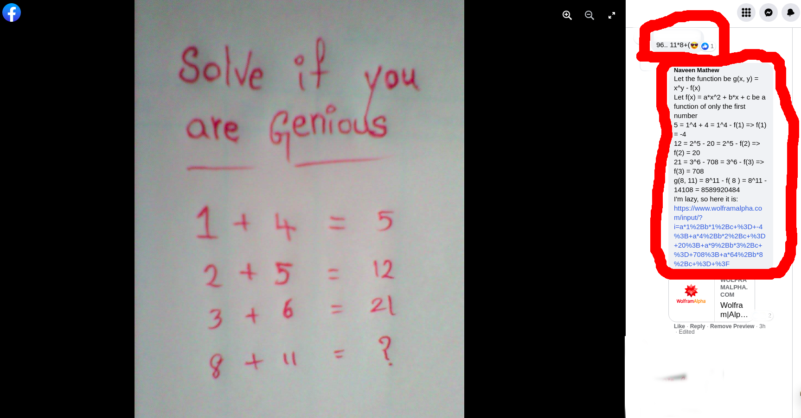
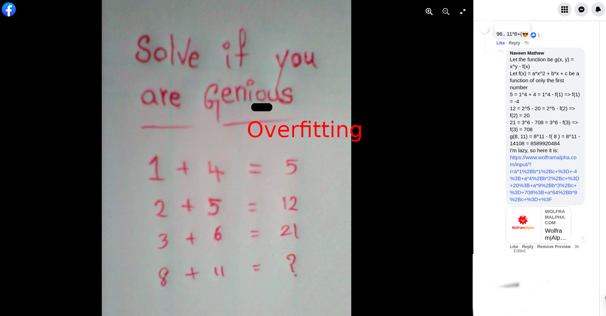

# Overfitting

Personally I like to add complexity to simple problems just to make people aware that there are multiple possible solutions to the same problem (kidding). I like elegant solutions, but stopping there does not serve my purpose. Here's a classic example:

But what people fail to realize is:

Looks like the training set for this language model was *copious* and the model was *ambitious*, but the creator was not a **genius**. When the rule fits the training set perfectly, but does not generalize well, we fall under a regime of machine learning called "overfitting" - memorizing the information in the training set, but failing to learn deeper meanings that generalize well to the validation and test sets. This simultaneously makes me *anxious* and *curious*. Isn't that *glorious*?

The intent of this exercise was to highlight two important factors that play a role in overfitting:
1. Number of independent training examples (n)
2. Number of independent variables (p)

Consider an additive linear model that maps the input variables to the output variables through the indepdent variables. The system is comparable to a system of linear *equations* with p variables and n equations. This setting is much more familiar to .