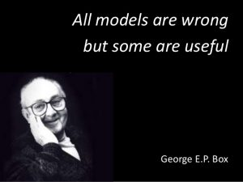

# Preface

## Who should read this book

This book is **intended** for readers who have at least a basic understanding of topics in linear algebra such as vector spaces, eigen values, eigen vectors, matrix inverse and generalized / pseudo inverse. The flow of the book is motivated by my personal journey - from an engineer (2008 - Present) to a statistician (2015 - Present) to an scientist (2020 - Present). However, this is not a unique trait - every book, if seen with a detective's eye, is the culmination of one or more personal journeys. To add to this, the book will have questions for which I don't have answers. Therefore, this book may be a futile effort towards compiling a coherent data science story. It may end up as an *unstructured* collection of blog posts.

(Updated on 06/16/2020): The planned content has a lot in common with [Mathematics for Machine Learning](https://mml-book.github.io/) book by Marc Peter Deisenroth, A. Aldo Faisal and Cheng Soon Ong. The planned content also has a lot in common [Regression Diagnostics](https://us.sagepub.com/en-us/nam/book/regression-diagnostics) by John Fox. The difference is that this book tries to establish a connection between basic mathematical statistics and topics in machine/deep learning.

## Who should not read this book

This book is **not intended** for people who have no background in data storage / retrieval, computing, linear algebra, statistics or machine learning and want a 1-hour summary of topics that will make them the '*best data scientist in the world*'. This book does not intersect with **Kaggle** competitions because they were not a part of my journey.

## Approach to Data Science

The primary objective of this book is to provide *one of many paths* to data science. In my opinion data science is about uncovering science from data and not just about accurate curve fitting. Of course, there is no denying that empirically accurate curve fitting is a reasonable way to do data science. People who choose this path may find inspiration from scientific greats like [Michael Faraday](https://en.wikipedia.org/wiki/Michael_Faraday) and [Ernest Rutherford](https://en.wikipedia.org/wiki/Ernest_Rutherford).

Readers of this book are assumed to be motivated by theoretical aspects of pattern recognition and wish to explain insights from experimental analysis using theory, or wish to use theory to design experiments that uncover scientific insights. Readers may find inspiration from scientific greats like [James Clerk Maxwell](https://en.wikipedia.org/wiki/James_Clerk_Maxwell) and [Niels Bohr](https://en.wikipedia.org/wiki/Niels_Bohr).

This book almost surely *will not* provide elegant solutions to real life problems in data science. Therefore, the concepts in this book are not comparable to [Maxwell's equations](https://en.wikipedia.org/wiki/Maxwell%27s_equations) or quantum mechanics. Given such an objective scientific statement, why should one read beyond this paragraph? The answer lies in the following statement by one of the greatest statisticians, [George Box](https://en.wikipedia.org/wiki/George_E._P._Box).

Industry needs people who can get the job done using libraries because the number of open business problems is very larger that fundamentals can take a back seat. This book will avoid such an approach and focus on the details.

## Golden rules

There are few golden rules that appear across topics in this book:

1. There is no free lunch
2. Not all stories have a fairytale ending; some stories don't have an ending
3. Pattern analysis may be an art, but we will stick to science. This gives us great power, and with great power comes great responsibility. We try to separate known-knowns from known-unknowns, unknown-knowns and unknown-unknowns
4. Here's a cliched one: hard work has no substitute because I'm not smart enough to provide smart solutions to smart people

**Note:** Murphy's law: "Anything that can go wrong will go wrong" given infinite opportunities. This is a finite book, but it has large number of opportunities for error, bias and misleading ideas. Few of these experiences (biases) are intentional and will be marked clearly with possible justifications.
